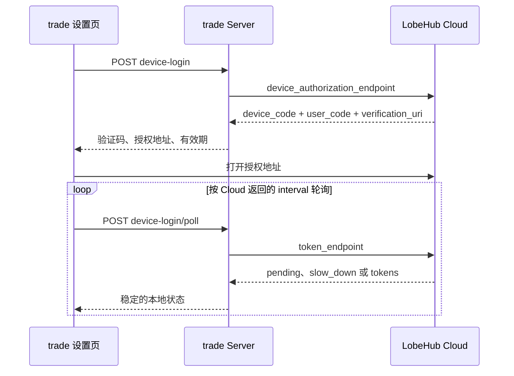

# LobeHub Cloud AI Provider 接入设计

日期：2026-07-12  
状态：已确认，等待 Cloud 前置能力完成后实施

## 背景

`trade` 已经具备统一的 AI 模型目录、加密凭据存储、角色模型分配和 pi-ai 运行时。现在希望增加一个 `lobehub` Provider，让用户通过 LobeHub Cloud 登录，直接使用 Cloud 提供的对话模型和个人额度，而不再为每个上游模型分别填写 API key。

LobeHub Cloud 当前已经具备完成调用所需的大部分运行时能力：

- OIDC Provider 支持 Device Authorization Flow 和 refresh token；
- `GET /webapi/lobehub-model-config` 可返回 Cloud 当前启用且可见的 LobeHub 在线模型目录；
- `POST /webapi/chat/lobehub` 会进入 LobeHub RouterRuntime；
- RouterRuntime 已接入个人额度检查、消费记录和实际扣费；
- Cloud tRPC 已提供订阅额度与消费记录查询；
- Cloud 请求链路支持 `traceId`、`sessionId` 和 `topicId`。

本设计的重点不是复制这些能力，而是在 `trade` 内建立稳定的上层抽象，把现有 `/webapi`、tRPC 和 SSE 协议限制在一个适配层中。未来 Cloud 改成正式的开发者 API 时，只替换适配器，不修改 AI 业务层。

## 已确认决策

| 维度       | 决策                                                        |
| ---------- | ----------------------------------------------------------- |
| 登录方式   | OIDC Device Flow，不启动 localhost OAuth callback           |
| Cloud 额度 | 仅使用用户个人账户额度，不支持 Workspace                    |
| 模型范围   | 只同步对话模型；允许对话模型具有图片输入能力                |
| 账户数量   | 单账户；重新登录替换现有账户                                |
| Cloud 接口 | 首版直接调用现有 `/webapi` 和 tRPC                          |
| 兼容边界   | 通过 `LobeHubCloudGateway` 隔离所有 Cloud 内部协议          |
| 设置页     | 展示账号、可用额度、本月使用量、模型数和更新时间            |
| 失败行为   | 不自动切换其他 Provider，不静默替换模型                     |
| 归因       | OIDC Client ID 用于可信应用归因，`traceId` 用于单次请求对账 |
| Cloud 改造 | 不在本任务实施；等待 Cloud 开发者 OAuth Client 功能完成     |

## 外部前置依赖

Cloud 团队需要先提供“开发者 OAuth 应用”产品能力。被平台认定为开发者的用户可以在设置中创建 OAuth Client。`trade` 是这套能力的首个使用方，不应在 Cloud 中作为特殊客户端写死。

本期 `trade` 需要的 Client 是 Device Flow public client：

```text
application_type = native
grant_types = device_code + refresh_token
token_endpoint_auth_method = none
```

public client 不生成 Client Secret，因为本地应用无法可靠保管 Secret。完整的 Web Client、Client Secret、Redirect URI、Scope 管理、审核、轮换、撤销和开发者控制台属于 Cloud 后续 OAuth 开发者体系，不在本任务范围内。

Cloud 前置能力完成后，`trade` 获得一个正式 Client ID。生产环境不复用 `lobehub-cli` 的 Client ID。Client ID 不是秘密，可以作为应用配置提交；Cloud 地址和 Client ID 允许在开发、测试环境覆盖。

## 目标与非目标

### 目标

- 用户可以在 `trade` 设置页通过 Device Flow 登录 LobeHub Cloud；
- access token 和 refresh token 加密保存在本地 server；
- token 到期时自动刷新，并正确处理 refresh token 轮换；
- `lobehub` 作为普通 pi-ai Provider 进入现有模型目录和角色分配；
- 四种 AI 用途都能调用 LobeHub Cloud 对话模型；
- 文字、思考过程、工具调用、用量和错误可以完整转换；
- 设置页展示个人可用额度和本月使用量；
- 每次调用同时在 `trade` 和 Cloud 中保留相同 `traceId`；
- Cloud 内部协议变化只影响一个适配器。

### 非目标

- 不实施 Cloud 开发者 OAuth Client 功能；
- 不支持 Workspace 选择或 Workspace 额度；
- 不支持图片生成、视频生成、语音生成和语音识别模型；
- 不支持多 LobeHub Cloud 账户切换；
- 不实现通用 OpenAI 兼容网关；
- 不复制 Cloud 的路由、模型定价或额度扣减逻辑；
- 不在 Cloud 不可用时自动降级到其他 Provider；
- 不承诺 `/webapi` 是长期稳定协议，稳定性由本地 Gateway 提供。

## 总体架构

```mermaid
flowchart LR
  subgraph Trade业务层
    Settings[设置与模型目录]
    AIRuntime[现有 AI Runtime]
    CreditUI[额度展示]
  end

  subgraph 统一抽象层
    Gateway[LobeHubCloudGateway]
    Provider[pi-ai LobeHub Provider]
  end

  subgraph 当前适配层
    WebAPI[WebApiLobeHubCloudGateway]
    OIDC[Device Flow Client]
    Parser[Cloud Stream Adapter]
  end

  subgraph Cloud
    Models[/webapi/lobehub-model-config]
    Chat[/webapi/chat/lobehub]
    Credits[subscription 和 spend tRPC]
  end

  Settings --> Gateway
  CreditUI --> Gateway
  AIRuntime --> Provider
  Provider --> Gateway
  Gateway --> WebAPI
  Gateway --> OIDC
  WebAPI --> Models
  WebAPI --> Chat
  WebAPI --> Credits
  WebAPI --> Parser
```

核心端口：

```ts
interface LobeHubCloudGateway {
  beginDeviceLogin(): Promise<DeviceLogin>;
  pollDeviceLogin(deviceCode: string): Promise<DeviceLoginResult>;
  logout(): Promise<void>;
  getAccount(): Promise<CloudAccount | null>;
  listChatModels(): Promise<CloudChatModel[]>;
  streamChat(request: CloudChatRequest): AssistantMessageEventStream;
  getPersonalCredits(): Promise<PersonalCreditSummary>;
}
```

当前实现为 `WebApiLobeHubCloudGateway`。它是唯一知道以下实现细节的模块：

- OIDC discovery、device authorization、token 和 revocation 端点；
- OIDC Client ID；
- `Oidc-Auth` 请求头；
- `/webapi/lobehub-model-config` 与 `/webapi/chat/lobehub`；
- Cloud tRPC 请求编码；
- `ChatStreamPayload`、Cloud SSE 和额度响应结构。

未来 Cloud 提供正式 API 时，新增 `ApiV1LobeHubCloudGateway` 并替换初始化绑定。设置页、scheduler、commentator、analyst、deep-dive、chat 和角色模型配置不变。

## Device Flow 与 Token 生命周期

### 本地接口

| 接口                                                        | 行为                   |
| ----------------------------------------------------------- | ---------------------- |
| `POST /api/settings/ai/providers/lobehub/device-login`      | 向 Cloud 申请设备码    |
| `POST /api/settings/ai/providers/lobehub/device-login/poll` | 查询用户是否完成授权   |
| `GET /api/settings/ai/providers/lobehub/account`            | 返回账号和认证状态     |
| `GET /api/settings/ai/providers/lobehub/credits`            | 返回稳定的个人额度摘要 |
| `DELETE /api/settings/ai/providers/lobehub/session`         | 退出并删除本地 token   |



```ts
type DeviceLoginResult =
  | { status: 'pending' }
  | { status: 'slow_down'; retryAfterMs: number }
  | { status: 'authenticated'; account: CloudAccount }
  | { status: 'denied' }
  | { status: 'expired' };
```

Cloud 原始 OAuth 错误不直接传给浏览器。

授权请求首版只申请 `openid profile email offline_access`。账号摘要通过 OIDC discovery 返回的 `userinfo_endpoint` 获取，不从未经验证的 token 字符串或 Cloud 页面结构猜测。Cloud 后续增加细粒度业务 scope 时，再由开发者 Client 配置和 Gateway 一并接入。

### Token 存储与刷新

复用现有 `provider_credentials` 表和 AES-256-GCM 加密，存储键为 `lobehub`：

```ts
{ type: 'oauth', access: string, refresh: string, expires: number }
```

现有凭据列表需要扩展，不能继续以“能否生成 API key 掩码”判断 OAuth 有效性：

```ts
interface CredentialListEntry {
  provider: string;
  kind: 'api_key' | 'oauth';
  masked: string | null;
  updatedAt: string;
  ok: boolean;
}
```

新增共享的 `LobeHubOAuthSession`。模型目录、模型调用和额度查询共用该 session。access token 接近到期时，通过 `CredentialStore.modify('lobehub', ...)` 串行刷新；Cloud 轮换 refresh token 时原子保存整套新凭据。`invalid_grant` 转成“需要重新登录”，网络错误不删除 refresh token。

退出时先尝试远端撤销，再删除本地凭据并清空动态模型缓存。无论远端撤销是否成功，本地退出都必须完成。角色原有模型选择保留并标记未认证，不自动切换 Provider。

## pi-ai Provider 集成

现有 `MutableModels` 支持 `setProvider()`，因此不在业务调用点增加 `if (provider === 'lobehub')`：

```ts
models.setProvider(createLobeHubProvider({ gateway }));
```

Provider 约定：

- `id = 'lobehub'`；
- 使用自定义 `api = 'lobehub-webapi'`；
- `refreshModels()` 调用 `gateway.listChatModels()`；
- `stream()` 和 `streamSimple()` 调用 `gateway.streamChat()`；
- OAuth 认证状态映射到现有 catalog；
- 登录前 Provider 可以存在，但模型列表为空且认证状态为 `missing`。

`allowedProviders()`、设置校验和 catalog 输出显式加入 `lobehub`。API key 写入接口仍拒绝 `lobehub`，登录和退出只能走专用 OAuth 接口。

## 模型目录与映射

Gateway 调用专用在线模型配置接口：

```http
GET /webapi/lobehub-model-config
```

不能用通用的 `/webapi/models/lobehub` 代替。通用接口会进入 Provider runtime 的 `models()`，它不是 LobeHub Cloud 在线模型配置的稳定来源；专用的 `lobehub-model-config` 才负责输出当前启用、可见的 LobeHub 模型及其能力、参数与价格。

专用目录当前不依赖 OIDC token 来生成模型列表。Gateway 只保留 `type = chat`、`enabled = true` 的模型。对话模型可以包含图片输入能力；图片生成、视频生成和语音模型不进入目录。用户级 beta 或套餐访问限制仍以实际 chat 请求结果为准；遇到 `model_unavailable` 时刷新目录并明确提示，不自动替换模型。

该接口当前使用 Better Auth 浏览器 session 计算个性化价格；纯 OIDC 调用可能只能得到基础价格。因此目录中的 `pricing` 只作本地预估，不能用于余额扣减、对账或覆盖 Cloud SSE 返回的真实 `usage.cost`。

| Cloud                   | pi-ai                    |
| ----------------------- | ------------------------ |
| `id`                    | `id`                     |
| `displayName`           | `name`                   |
| `abilities.reasoning`   | `reasoning`              |
| `abilities.vision`      | `input` 是否包含 `image` |
| `contextWindowTokens`   | `contextWindow`          |
| `maxOutput`             | `maxTokens`              |
| `pricing`               | 本地预估 `cost`          |
| `settings.extendParams` | 思考档位映射依据         |

刷新时机：

- server 启动后若已登录，拉取一次；
- Device Flow 登录成功后立即拉取；
- 打开设置页时刷新；
- 用户手动刷新；
- 请求遇到模型不存在时刷新一次目录后再返回错误，不重放模型请求。

目录刷新失败时保留最后一次成功结果，并显示目录更新时间和错误状态。Cloud 模型临时消失时保留角色配置并标记 stale；模型重新出现后自动恢复。

## 请求转换

pi-ai 上下文转换成 Cloud `ChatStreamPayload`：

```ts
{
  model: model.id,
  messages: convertContext(context),
  tools: convertTools(context.tools),
  stream: true,
  reasoning_effort: resolveReasoningEffort(model, options.reasoning),
  thinkingLevel: resolveThinkingLevel(model, options.reasoning)
}
```

规则：

- `systemPrompt` 转成第一条 `system` 消息；
- 历史文字消息保持顺序；
- tool call 和 tool result 保持原始 ID；
- `off` 映射为 `reasoning_effort: 'none'`；
- 其他档位根据模型 `settings.extendParams` 映射到 `reasoning_effort` 或 `thinkingLevel`；
- 不按模型 ID 维护硬编码判断表；
- `AbortSignal` 直接传给 `fetch`；
- 每次请求由 Gateway 自动注入归因和追踪头。

## SSE 流式协议转换

| Cloud SSE             | pi-ai                                                |
| --------------------- | ---------------------------------------------------- |
| `text`                | `text_start` / `text_delta` / `text_end`             |
| `content_part` 文字   | `text_delta`                                         |
| `reasoning`           | `thinking_start` / `thinking_delta` / `thinking_end` |
| `reasoning_part` 文字 | `thinking_delta`                                     |
| `tool_calls`          | `toolcall_start` / `toolcall_delta` / `toolcall_end` |
| `usage`               | 累积到最终 `AssistantMessage.usage`                  |
| `stop`                | `stop`、`length` 或 `toolUse`                        |
| `error`               | pi-ai `error`                                        |
| 网络取消              | `aborted`                                            |

工具调用使用独立 accumulator，按 `index` 和 `id` 合并函数名与 JSON 参数。参数形成合法 JSON 后才发送 `toolcall_end`。

不直接依赖 Cloud 的 `fetchSSE` 包。适配层实现小型 SSE parser，并用固定 fixture 做行为测试。未知的非关键事件写 diagnostic 后忽略；未知的文字、工具或终止事件返回 `protocol_incompatible`。

## 用量、额度与归因

### 单次用量

Cloud SSE 的 `usage` 是真实扣费依据：

| Cloud                   | pi-ai         |
| ----------------------- | ------------- |
| `totalInputTokens`      | `input`       |
| `totalOutputTokens`     | `output`      |
| `inputCachedTokens`     | `cacheRead`   |
| `outputReasoningTokens` | `reasoning`   |
| `totalTokens`           | `totalTokens` |
| `cost`                  | `cost.total`  |

Cloud 未提供输入、输出分别计价时，`cost.input` 和 `cost.output` 置零，只将真实金额写入 `cost.total`。本地模型价格只用于目录展示或预估，不能覆盖 Cloud 返回的真实扣费。`trade` 现有 `ai_usage` 增加 `traceId`，用于与 Cloud 消费记录对账。

### 个人额度

Gateway 组合 Cloud 的 `subscription.getSubscription` 与 `spend` 查询，转换成：

```ts
interface PersonalCreditSummary {
  available: number;
  monthSpend: number;
  currency: 'USD';
  free: CreditBucket;
  subscription: CreditBucket;
  packages: CreditBucket;
  referral: CreditBucket;
  updatedAt: string;
}
```

可用额度沿用 Cloud 当前前端口径：

```text
未过期免费额度余额
+ 订阅额度余额
+ 有效充值包余额
+ 未过期邀请额度余额
```

“本月已使用”以当前自然月起止时间查询个人 spend log，并按 Cloud 的 credit 单位换算为 USD。分页查询必须读取完整时间范围，不能只统计第一页，也不能用“最近 30 日”冒充自然月。

刷新策略：设置页打开时请求；成功完成模型调用后延迟刷新；最多缓存 30 秒；支持手动刷新。额度查询失败不阻断模型调用；模型调用返回额度不足时立即标记“已耗尽”，以 Cloud 请求结果为准。

### 应用归因

Cloud 开发者 OAuth Client 完成后，经过验证的 Client ID 是可信应用来源。`trade` 另外在每次请求中发送：

```ts
{
  enabled: true,
  sessionId: `trade:${localSessionId}`,
  topicId: `trade:${role}:${localTopicId}`,
  traceId,
  tags: ['client:trade']
}
```

该对象按现有协议 Base64 编码后放入 `X-lobe-trace`。Client ID 用于应用级归因，`traceId` 用于单次请求对账，`sessionId` 和 `topicId` 用于本地业务上下文定位。

## 设置页

为 `lobehub` 增加专用 Provider 行：

```ts
type LobeHubConnectionStatus =
  'disconnected' | 'authorizing' | 'connected' | 'refresh_required' | 'unavailable';
```

| 状态         | 展示                       | 操作             |
| ------------ | -------------------------- | ---------------- |
| 未连接       | 尚未登录 LobeHub Cloud     | 登录             |
| 授权中       | 验证码、剩余时间、授权地址 | 打开授权页、取消 |
| 已连接       | 账号、额度、模型数量       | 刷新、退出       |
| 需要重登     | 登录已失效                 | 重新登录         |
| Cloud 不可用 | 保留账号和上次额度         | 重试             |

Device Flow 弹窗：

```text
连接 LobeHub Cloud

请在 LobeHub Cloud 确认登录
验证码：ABCD-EFGH

[复制验证码] [打开 LobeHub Cloud]

等待授权……
```

创建设备码后尝试自动打开授权地址，同时保留复制验证码和再次打开入口。轮询严格遵守 Cloud 返回的 `interval`，`slow_down` 后增加间隔。关闭弹窗终止本地轮询，但不删除已有登录凭据。登录成功后刷新账号、额度、模型目录和 catalog。token 永不返回浏览器。

已连接摘要：

```text
LobeHub Cloud
账号：user@example.com
可用额度：$12.34
本月已用：$3.21
对话模型：18 个
更新于：14:32
```

未登录时不允许新选择 `lobehub`；退出后保留已有角色配置并显示“需要重新登录”；模型 stale 时不自动替换；额度不足时不隐藏模型；设置页测试按钮走正式 Gateway 和流式转换路径。

## 错误模型

```ts
type LobeHubCloudErrorCode =
  | 'not_authenticated'
  | 'authorization_pending'
  | 'authorization_denied'
  | 'device_code_expired'
  | 'refresh_required'
  | 'insufficient_credits'
  | 'model_unavailable'
  | 'rate_limited'
  | 'network_error'
  | 'cloud_unavailable'
  | 'protocol_incompatible';
```

| 错误               | 行为                         |
| ------------------ | ---------------------------- |
| access token 到期  | 自动刷新后重新执行认证步骤   |
| refresh token 失效 | 标记需要重新登录             |
| 额度不足           | 不重试，立即刷新额度         |
| 模型不可用         | 刷新目录，不自动替换模型     |
| 429                | 展示等待时间，不密集重试     |
| 模型请求网络错误   | 不自动重试，避免重复扣费     |
| 流中断             | 保留已收到内容，任务标记失败 |
| Cloud 5xx          | 返回 Cloud 暂不可用          |
| SSE 协议变化       | 返回协议不兼容并记录脱敏诊断 |

正式模型调用即使尚未收到首个 chunk，也不自动重放。网络是否已经把请求送达 Cloud 无法可靠判断，自动重放可能造成重复生成和重复扣费。

## 安全边界

- access token 和 refresh token 只保存在 server 加密凭据表；
- 浏览器只获取账号摘要和状态；
- 日志清理 `Oidc-Auth`、Bearer token、device code 和 refresh token；
- Device Flow 待授权状态只保存在内存，到期删除；
- 单账户新登录原子替换旧凭据；
- `traceId` 可以记录，完整请求正文和完整模型回答不进入认证日志；
- Client ID 不是秘密；未来若支持 Client Secret，只能保存在 server；
- Cloud 返回的错误正文先脱敏，再进入本地日志或 API hint。

## 测试

### 行为测试

- Device Flow：pending、slow_down、成功、拒绝、过期、取消；
- token：到期刷新、refresh token 轮换、并发只刷新一次、失败后可重试；
- credential list：OAuth 凭据不再被误判为损坏；
- 模型：仅保留对话模型、字段映射、刷新失败保留旧目录、stale 恢复；
- 思考档位：`off`、`reasoning_effort`、`thinkingLevel`；
- SSE：文字、思考、工具调用分片、usage、stop、error、abort；
- 工具调用参数跨 chunk 合并后仍可执行；
- 额度：四类余额汇总、过期额度排除、自然月消费完整分页聚合；
- 归因：请求注入 Client ID 对应 token、共享 `traceId` 和 `trade:` 命名空间；
- 安全：响应、异常和日志均不包含 token；
- 退出：删除凭据、清空动态目录、保留角色配置；
- 错误：额度不足、429、5xx、协议不兼容不触发 Provider 降级。

### 集成测试

本地假 Cloud Server 模拟：

```text
OIDC discovery
device_authorization_endpoint
token_endpoint
revocation_endpoint
/webapi/lobehub-model-config
/webapi/chat/lobehub
subscription.getSubscription
spend.getList
```

保存脱敏的 Cloud SSE fixture 作为兼容测试。测试验证可观察行为，不对内部常量表、allowlist 或静态对象做实现快照。

### 真实验收

等待 Cloud 开发者 OAuth Client 功能完成后：

1. 在 Cloud 创建 `trade` Device Flow Client；
2. 在 `trade` 完成 Device Flow 登录；
3. 验证账号、模型、余额和本月使用量；
4. 四种 AI 用途分别调用 LobeHub 模型；
5. 工具调用完成多轮往返；
6. 思考档位正确传递；
7. Cloud 个人额度正确扣减；
8. `trade` 与 Cloud 通过 `traceId` 对账；
9. Cloud 能按 Client ID 聚合来源；
10. 退出并重新登录后恢复；
11. 模拟 token 到期，验证 refresh token 轮换；
12. 模拟 Cloud 错误，验证不自动切换 Provider。

## 预计改造面

具体文件名可在实施计划中调整，职责边界保持如下：

- 新增 LobeHub Cloud Gateway 端口与 `/webapi` 适配器；
- 新增 OIDC discovery、Device Flow 和 OAuth session；
- 新增 Cloud SSE 到 pi-ai 的 stream adapter；
- 新增动态 `lobehub` pi-ai Provider；
- 扩展凭据列表以正确识别 OAuth；
- 扩展设置服务的登录、退出、账号和额度接口；
- 扩展设置页的 LobeHub Provider 卡片和 Device Flow 弹窗；
- 为 `ai_usage` 增加 `traceId`；
- 增加 fake Cloud Server、协议 fixture 和行为测试。

## 实施门槛

在以下条件满足前不开始业务实现：

1. Cloud 开发者 OAuth Client 第一期已上线或至少在可验证环境可用；
2. 已创建 `trade` Device Flow Client；
3. 已确认 OIDC discovery 能返回 device、token 和 revocation 端点；
4. 已验证 `/webapi/lobehub-model-config` 返回在线模型目录，并用该 Client ID 验证 `/webapi/chat/lobehub` 和额度 tRPC 接受 OIDC token；
5. 已确认 Cloud 会把 Client ID 作为可信来源用于归因。

满足门槛后，再单独编写实施计划并进入代码阶段。
