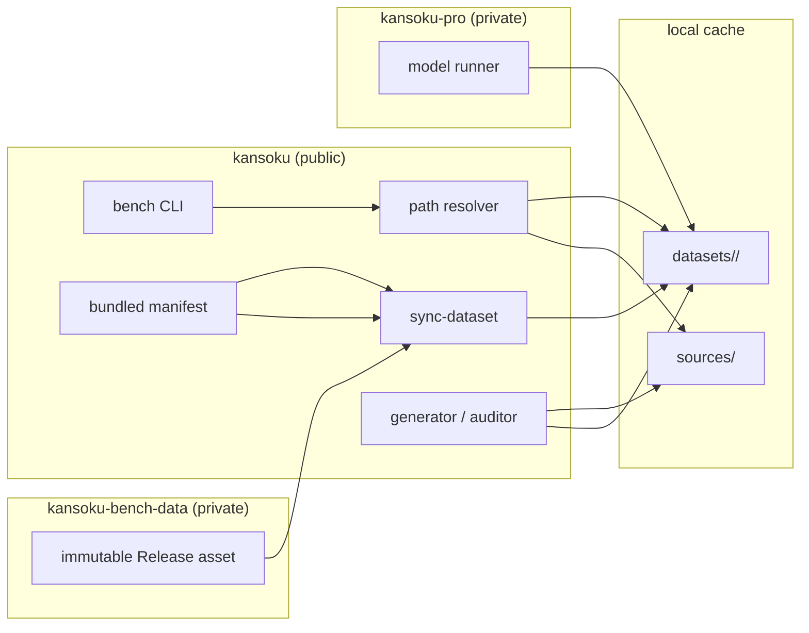

# Benchmark 数据集所有权与分发边界

日期：2026-07-18

## 1. 决策

Benchmark 代码、模型执行器、完整数据资产与源数据缓存采用四个独立边界：

| 边界                         | 所有者        | 保存内容                                                        | 不保存内容                       |
| ---------------------------- | ------------- | --------------------------------------------------------------- | -------------------------------- |
| `kansoku`（公开）            | framework     | schema、生成器、审计器、同步器、manifest、最小测试 fixture      | 完整题库、源数据缓存、模型执行器 |
| `kansoku-pro`（私有）        | runner        | agent runner、mock 工具、trace 与模型执行逻辑                   | 发布数据资产                     |
| `kansoku-bench-data`（私有） | data registry | manifest schema、每个发布版本的 manifest、GitHub Release assets | 大型 JSON 文件的 Git 历史        |
| 用户缓存目录                 | local runtime | 已安装题库、行情/新闻原始缓存                                   | 可复现代码契约                   |

本次迁移不改写既有 Git 历史。已有题库在确认 Release 资产可下载且 SHA-256 一致后，以普通提交从 `kansoku` 当前树中移除。

## 2. 运行时架构

## 3. 数据集身份与 manifest

运行参数 `--dataset-version` 在兼容现有 CLI 的前提下表示稳定的 dataset id，例如 `v1` 或 `v2-preview`。内容版本由 `(id, revision)` 唯一标识，revision 使用 `r1`、`r2` 形式。

每个 manifest 至少包含：

- schema 版本、dataset id、revision、数据形态与可见性；
- 私有数据仓库、Release tag、资产名、压缩包根目录；
- 资产字节数与 SHA-256；
- 各 bank 的 JSON 题目数量；
- 生成器仓库与精确 commit；
- 发布时间。

Release 资产命名为 `kansoku-bench-<id>-<revision>.tar.zst`，压缩包只包含 `<id>/...`。同一 tag 和 revision 不覆盖、不替换；修正内容必须发布新的 revision。

## 4. 本地路径契约

| 优先级 | 数据集目录                        | 源缓存目录                       |
| ------ | --------------------------------- | -------------------------------- |
| 1      | `--dataset-dir`                   | `--source-cache-dir`             |
| 2      | `KANSOKU_BENCH_DATA_DIR`          | `KANSOKU_BENCH_SOURCE_CACHE_DIR` |
| 3      | `~/.cache/kansoku/bench/datasets` | `~/.cache/kansoku/bench/sources` |

数据集目录只保存发布内容与安装标记；源缓存目录保存 Longbridge、GDELT、EDGAR 等可重新获取的原始输入。两者不得嵌套，从而避免将数 GB 缓存误打包为数据集或提交进 Git。

## 5. 同步协议

`sync-dataset` 执行以下步骤：

1. 读取并校验公开仓库内的 bundled manifest；
2. 使用已认证的 GitHub CLI 从私有数据仓库下载指定 Release 资产；
3. 校验文件字节数与 SHA-256；
4. 解压到数据目录内的临时目录；
5. 校验压缩包根目录以及各 bank 的 JSON 文件数量；
6. 写入 `.kansoku-dataset.json` 安装标记；
7. 通过同一文件系统内的 rename 原子安装。

若目标目录已有匹配标记，同步是幂等操作并直接返回 `present`。若目标目录存在但标记缺失或不匹配，同步拒绝覆盖，要求操作者先人工检查并移走该目录。任何下载、校验或解压失败都清理临时目录，不留下半安装状态。

## 6. 发布流程

1. 生成器在显式 staging `--dataset-dir` 中构建题库；原始行情与新闻进入独立 `--source-cache-dir`。
2. 运行 schema 校验、泄漏审计、题目抽查及 benchmark smoke test。
3. 以 dataset id 为压缩包根目录创建 `.tar.zst`，记录字节数和 SHA-256。
4. 在 `kansoku-bench-data` 创建不可变 Release 并上传资产。
5. 从远端重新下载资产，复核 SHA-256 与目录结构。
6. 将 manifest 同步到 data registry 与 `kansoku` bundled manifests。
7. 在干净临时目录运行真实 `sync-dataset`，再由 public/pro runner 完成端到端验证。

## 7. 初始迁移

| Dataset          | Revision | Release tag                 | Bank 数量   |
| ---------------- | -------- | --------------------------- | ----------- |
| `v1`             | `r1`     | `dataset-v1-r1`             | `swing: 60` |
| `v2-preview`     | `r1`     | `dataset-v2-preview-r1`     | `swing: 1`  |
| `v2-live-pilot`  | `r1`     | `dataset-v2-live-pilot-r1`  | `swing: 12` |
| `v2-blind-pilot` | `r1`     | `dataset-v2-blind-pilot-r1` | `swing: 12` |

本地未跟踪的 smoke 数据、Playwright 状态和输出目录不属于迁移范围，不删除也不发布。
