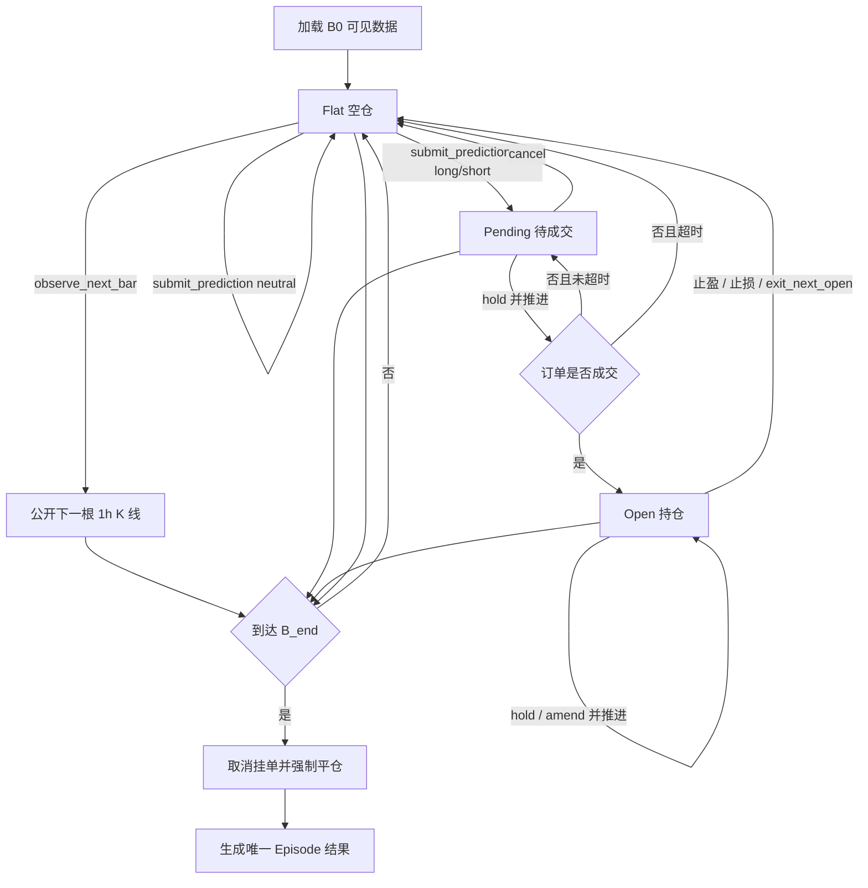

# Bench v2：固定时域连续交易 Episode 设计

日期：2026-07-18
状态：核心状态机、Message Engine 消息管线、长桥数据审计和 HTML 报告已实现；真实模型单 case 复测进行中。

## 1. 核心定义

一个 case 不再等于一笔交易，而是一个从 `B0` 到 `B_end` 的固定时域交易 Episode。

- `B0` 是 case cutoff；
- `B1` 是第一根回放 1 小时 K 线；
- Agent 从 `B0` 起即可下单，也可以自主观察；
- 止盈、止损、撤单、未成交超时和主动平仓只结束当前订单或持仓；
- 平仓后回到空仓，Agent 可以继续观察并再次入场；
- 只有最后一根 K 线处理完毕后，case 才会终结；
- 最后一根结束时，所有剩余持仓按收盘价强制平仓，未成交订单取消。

每个标的和 cutoff 都构成独立 case。case 之间不共享会话、盈亏或消息历史；同一 case 内始终保持同一个 Agent 会话。

## 2. 测量目标

Episode 同时测量：

- Agent 在多周期历史下的首次判断；
- 是否选择等待，以及首次入场所在的 B 编号；
- 入场、止损和目标是否合理；
- 持仓后是否继续观察、调整保护位或主动退出；
- 一笔交易结束后是否能识别新的机会并重新入场；
- 完整固定周期内的累计收益、回撤和交易成本；
- Agent 的工具调用是否满足无未来数据、逐根推进和成交时序约束；
- 完成整个 case 的模型调用、token、时间和 USD 成本。

排行榜的主统计单位仍然是 case。一个 case 内做了多少笔交易，都只贡献一次 case 权重。

## 3. 状态机



实际实现使用四个阶段：

| 阶段 | 含义 | 可用交易动作 |
| --- | --- | --- |
| `flat` | 当前没有挂单和持仓 | 观察、提交 long/short/neutral |
| `pending` | 方向订单等待成交 | `hold`、`cancel` |
| `open` | 已有一笔净持仓 | `hold`、`amend`、`exit_next_open` |
| `terminal` | 最后一根 K 线已经结算 | 不允许再调用推进或交易工具 |

当前版本使用单一净持仓，不允许同时持有多空，也暂不支持部分加仓和部分减仓。Agent 可以通过完整平仓后重新提交，实现多次交易和方向切换。

## 4. 决策与观察

没有强制观察阶段，也没有决策截止窗口：

- Agent 可以在 `B0` 立即提交方向计划；
- 也可以在空仓时反复调用 `observe_next_bar`；
- `neutral` 只记录当前保持空仓，不终结 case；
- 始终没有下单的 case 在 `B_end` 以 `no_trade` 结算，净 R 为 0；
- `decisionBar` 表示第一次方向订单所在位置，是测量指标，不是准入条件；
- 旧数据中的 `decisionExpiryBars` 只用于兼容历史文件，新生成的 v2 case 不再写入该字段。

若 Agent 在 `Bn` 提交订单，订单最早只能在尚未公开的 `B(n+1)` 生效。它不能看到 `Bn` 的完整 OHLC 后，再追溯到 `Bn` 内成交。

## 5. 工具协议

### 5.1 只读工具

| 工具 | 行为 |
| --- | --- |
| `read_data_pack` | 读取当前虚拟时钟下的多周期摘要 |
| `fetch_kline` | 读取当前可见的 `h1`、`day`、`week` K 线 |
| `fetch_news` | live 模式读取当前时点以前的事件；blind 始终为空 |
| `run_code` | 只对当前已经公开的数据执行计算 |

这些工具不得改变游标。

### 5.2 状态工具

| 工具 | 行为 |
| --- | --- |
| `observe_next_bar` | 仅空仓可用，恰好公开下一根 1 小时 K 线 |
| `submit_prediction` | 仅空仓可用，一个 case 内可以重复提交；方向订单从下一根 K 线开始生效 |
| `advance_trade` | 根据当前阶段提交管理动作，并至多公开下一根 1 小时 K 线 |

`advance_trade` 的动作结构：

```ts
interface EpisodeTradeReason {
  category: "trend_following" | "breakout" | "pullback" | "mean_reversion"
    | "support_resistance" | "momentum" | "volume_flow" | "volatility"
    | "news_event" | "fundamental" | "risk_management" | "thesis_invalidated"
    | "profit_protection" | "time_horizon" | "no_setup" | "other";
  summary: string;
}

type EpisodeTradeAction =
  | { type: "hold"; reason: EpisodeTradeReason }
  | { type: "amend"; stop?: number; target?: number; reason: EpisodeTradeReason }
  | { type: "cancel"; reason: EpisodeTradeReason }
  | { type: "exit_next_open"; reason: EpisodeTradeReason };
```

`submit_prediction` 同样必须提交 `decision_reason: EpisodeTradeReason`。这是模型主动提供的、可审计的决策依据摘要，不是隐藏思维链。缺少理由的工具调用由 runner 拒绝，模型必须修正后重新提交。

- `flat + hold` 与继续观察等价；
- `pending + cancel` 在当前虚拟时点撤单，不公开新 K 线；
- `open + amend` 的新止损或目标从下一根尚未公开的 K 线生效；
- `open + exit_next_open` 在下一根 K 线开盘价退出；
- 工具只有在 `B_end` 结算完成后才返回 `terminal=true`。

## 6. 单步执行顺序

每次推进严格按以下顺序：

1. Agent 只能根据当前游标及以前的数据选择动作；
2. 引擎校验动作是否适用于当前阶段；
3. 除 `cancel` 外，引擎取出下一根尚未公开的 1 小时 K 线；
4. 按推进前已经生效的订单、止损和目标处理成交；
5. 同根同时触及止损和目标时，采用保守规则，先按止损结算；
6. 完成订单和持仓状态变化后，才把新 K 线与事件返回 Agent；
7. 如果交易结束但尚未到 `B_end`，阶段回到 `flat`，case 继续；
8. 如果该 K 线是 `B_end`，先处理原有订单，再按收盘价强制平仓并终结 case。

止损跳空穿越时按更差的实际开盘价成交；目标跳空穿越时按更优的实际开盘价成交。stop-entry 和 limit-entry 也使用相同的真实开盘穿越规则。若挂单在开盘成交时已经越过该订单原有的止损或目标，则成交与对应退出均按该开盘价处理，不再把此后同一根 K 线的高低点计入 MFE、MAE 或持仓时长。

## 7. Message Engine 消息管线

Episode 不直接把动态状态拼进持久对话，而是复用现有 `MessagesEngine`，为每次 provider 请求构造临时消息视图。


| Provider | 位置 | 内容 |
| --- | --- | --- |
| `EpisodePolicyProvider` | 第一条用户消息以前 | 固定时域、重复入场、成交时序和工具规则 |
| `EpisodeDataPackProvider` | 第一条用户消息以前 | B0 可见数据快照 |
| `EpisodeRuntimeTailProvider` | 消息尾部 | 当前 B 编号、剩余 K 线、阶段、挂单、持仓、已完成交易数和累计净 R |

Tail Provider 每次请求都从引擎实时状态重算，注入内容不写入 `Agent.state.messages`。因此不会在历史消息中累积或保留过期的倒计时。

用于唤醒提前停止 Agent 的 continuation prompt 只保留无状态指令；阶段、持仓和剩余时间全部由 Message Engine 注入。

## 8. 最后五根 K 线提醒

剩余数量定义为：

```ts
remainingBars = horizonBars - cursor - 1;
```

当 `remainingBars` 为 5、4、3、2、1 时，`EpisodeRuntimeTailProvider` 每次都插入准确提醒：

```xml
<horizon_warning priority="high" remaining_bars="5">
距离 Episode 强制结算还有 5 根尚未公开的 1 小时 K 线。
最后一根完成后，所有剩余持仓将按收盘价强制平仓，未成交挂单将被取消。
请根据剩余窗口管理仓位与退出计划，不得假设持仓期限可以继续延长。
</horizon_warning>
```

倒数一根使用 `critical`：

```xml
<horizon_warning priority="critical" remaining_bars="1">
下一根 1 小时 K 线是本 Episode 的最后一根。
当前操作只拥有这一根 K 线的生效窗口；该 K 线完成后将立即强制结算。
</horizon_warning>
```

最后一根处理完成后直接返回 `terminal=true`，不再发起“剩余 0 根”的模型请求。

## 9. 数据与防泄漏边界

三个周期的权威数据源均为长桥：

- 初始 1 小时窗口：210 根；
- 初始日线窗口：250 根；
- 初始周线窗口：104 根；
- 默认回放：40 个交易 session，实际 `horizonBars` 根据长桥返回的交易时段确定；
- 已完成的日线和周线使用长桥原生周期线；
- 尚未完成的日或周只能由当前已经公开的 1 小时线临时聚合；
- 到达原生周期线的 `availableAt` 后，再用长桥原生 bar 替换临时聚合。

每次推进后必须满足：

- `fetch_kline`、data pack、news 和 `run_code` 的 `as_of` 完全一致；
- 只读工具调用前后 B 编号不变；
- `observe_next_bar` 和 `advance_trade` 每次最多增加一个 B 编号；
- 动作不能影响已经公开的 K 线；
- 日线或周线不得包含当前虚拟时钟之后的数据；
- benchmark controller 是唯一可以读取完整 replay 的组件。

最后五根 K 线的剩余数量属于明确的交易期限约束，允许通过 Message Engine 向 Agent 公开；在 T-5 以前不公开完整 horizon 长度或结束日期。

## 10. 成交窗口与风险单位

待成交订单默认最多保留前三个完整交易 session，生成器将对应的实际 1 小时 bar 数写入 `entryExpiryBars`。订单超时或取消后回到空仓，Agent 可以重新提交新的计划。

每笔已成交交易独立固定风险单位：

```text
initialRisk = abs(entryPrice - initialStop)
```

后续移动止损或目标不会改变该笔交易的 R 分母：

```text
longGrossR  = (exitPrice - entryPrice) / initialRisk
shortGrossR = (entryPrice - exitPrice) / initialRisk
frictionR   = costBps / 10_000 * (entryPrice + exitPrice) / initialRisk
netR        = grossR - frictionR
```

Episode 的 `grossR`、`frictionR` 和 `netR` 是所有已完成交易对应 R 的总和。当前版本等价于每次入场都使用同一个 1R 风险预算；后续若加入仓位大小，再把结果升级为权益曲线口径。

## 11. 结果契约

每个 case 只写一条最终结果，内部包含零到多笔完整交易：

```ts
interface EpisodeClosedTrade {
  tradeId: number;
  direction: "long" | "short";
  decisionBar: number;
  decisionTime: string;
  entry: ExecutionPoint;
  exit: ExecutionPoint;
  exitReason: "stop" | "target" | "manual" | "horizon";
  initialStop: number;
  finalStop: number;
  target: number;
  initialRisk: number;
  grossR: number;
  frictionR: number;
  netR: number;
  mfeR: number;
  maeR: number;
  holdingBars: number;
  entryReason?: EpisodeTradeReason;
}

interface EpisodeTradeResult {
  terminationReason: "horizon" | "no_trade";
  grossR: number;
  frictionR: number;
  netR: number;
  tradeCount: number;
  winCount: number;
  lossCount: number;
  maxDrawdownR: number;
  decisionBar: number | null;
  decisionTime: string | null;
  observationBars: number;
  trades: EpisodeClosedTrade[];
  actions: EpisodeActionRecord[];
}
```

顶层 `entry`、`exit` 和 `direction` 暂时保留，兼容旧报告；新报告以 `trades` 为准。

## 12. 指标

| 指标 | 口径 |
| --- | --- |
| 每 case 平均净 R | 所有完成 case 的 Episode `netR` 均值；全程空仓记 0，主排序指标 |
| Episode 胜率 | 最终 `netR > 0` 的 case 占所有完成 case 的比例 |
| 交易胜率 | 所有完整 round trip 中 `netR > 0` 的比例 |
| 单笔期望 | 所有完整交易的平均 `netR` |
| Profit Factor | 所有交易正 `netR` 总和除以负 `netR` 绝对值总和 |
| 参与率 | 至少提交过一个方向计划的 case 占比 |
| 成交率 | 至少成交一笔的 case 占提交过方向计划 case 的比例 |
| 方向命中 | 第一次方向判断与 B0 到 B_end 最终方向一致的比例 |
| MFE / MAE | 每笔交易持仓期间的最大有利和不利波动 |
| 最大回撤 | 按已结算交易累计净 R 计算的 Episode 最大回撤 |
| 决策位置 | 第一次方向提交所在的 B 编号；B0 立即交易是合法结果 |
| 理由覆盖率 | 已提交结构化理由的交易决策动作数除以全部交易决策动作数，并按模型分别统计 |
| 原因表现 | 按“模型 × 入场主原因”统计提交数、成交数、胜率、平均净 R 与累计净 R |
| 效率 | 每 case 的工具调用、模型调用、token、耗时和 USD 成本 |

不允许只统计“有交易的胜率”作为主胜率，也不允许把全程空仓 case 从分母中删除。

## 13. HTML 报告

报告保持简单、紧凑，以审计交易过程为优先：

| 区域 | 内容 |
| --- | --- |
| 运行总览 | 平均净 R、Episode/交易胜率、方向命中、Profit Factor、参与/成交、期望、MFE/MAE、回撤、成本和耗时 |
| 交易原因统计 | 按模型和主原因统计理由覆盖、动作分布、入场/成交、胜率和净 R |
| 数据配置 | 1h/day/week 数量、完整回放窗口、待成交窗口、T-5 提醒、长桥日/周回填 |
| Case 图表 | TradingView Lightweight Charts 的 1 小时、日线、周线 K 线和成交量 |
| 图表标注 | `CASE START · B0`、首根回放、`B_end · 强制结算`、每笔决策、成交、初始止损、目标和退出 |
| 交易明细 | 每笔交易的方向、决策/成交/退出 B 编号、E/S/T/X、入场理由、退出原因和净 R |
| 工具链 | 只读查询、观察、提交、管理动作、显式决策理由及其 B 编号和阶段变化 |
| Message Engine | `T-5` 到 `T-1` 强平提醒节点，以及提醒完整性检查 |
| 数据审计 | 长桥 1h/day/week、cutoff、时区、滚动周期和未来数据边界 |

点击工具或提醒节点时，图表切换到该节点对应的 B 编号及周期，只展示当时已经公开的数据。报告不展示隐藏思维链；它展示模型在每次交易操作中主动提交的结构化理由摘要、工具输入、状态变化、消息注入元数据和结果摘要。

## 14. Trace 与消息审计

每次工具调用记录：

- 调用前后 B 编号和虚拟时钟；
- 调用前后阶段；
- 当前挂单和持仓摘要；
- 已完成交易数和 Episode 累计净 R；
- 工具参数、结果摘要、耗时和错误状态。

每次 Message Engine 处理额外写入 `prompt_context`：

```ts
interface PromptContextTrace {
  virtualAsOf: string;
  barIndex: number;
  phase: string;
  remainingBars: number;
  tradeCount: number;
  episodeNetR: number;
  warningInjected: boolean;
  warningPriority: "high" | "critical" | null;
}
```

报告自动检查：

- 三周期是否在首次方向提交前读取；
- 每次方向提交是否发生在空仓阶段；
- 只读工具是否没有推进游标；
- 推进工具是否每次最多增加一个 B 编号；
- 完成 case 是否确实走到 `B_end`；
- T-5、T-4、T-3、T-2、T-1 是否全部注入；
- 是否存在被引擎拒绝的非法工具调用。

## 15. blind 与 live

blind 和 live 使用完全相同的状态机。区别只在可见信息：

| 模式 | K 线 | 事件 |
| --- | --- | --- |
| blind | 长桥 1h/day/week 滚动视图 | 不提供新闻、基本面和日历事件 |
| live | 与 blind 相同 | 只提供 `published_at <= virtualClock` 的新闻、公告和日历事件 |

无法按历史时点还原的数据必须留空，不能把当前快照回填到历史 case。

V2 pilot 为扩大盲盘形态覆盖，采用独立的 live 与 blind cohort；blind 的历史源行情会先完成身份、时间和价量匿名化。两组不是配对题，不能直接计算消息面的成对差值。完整规则见 `2026-07-18-bench-v2-pilot-dataset-design.md`。

## 16. 错误与榜单资格

- provider 网络错误和限流按运行器规则重试；重试耗尽记 `api_error`；
- 非法阶段调用、终结后继续推进或参数不合法记 `protocol_violation`；
- 单 case 超时记 `timeout`；
- 基础设施失败不参与交易指标；
- 模型侧协议失败不能伪装成观望；
- 断点续跑键仍为 `(model, questionId, mode, rep)`；
- 只在完整结果和 trace 都写入后，才认为该 case 完成。

## 17. 当前实现与待办

| 工作项 | 状态 |
| --- | --- |
| 固定时域、多次重新入场状态机 | 已实现 |
| B0 起自主交易、取消决策窗口 | 已实现 |
| T-5 至 T-1 Message Engine 动态提醒 | 已实现 |
| 工具与 Prompt trace | 已实现 |
| 多笔交易结果契约和 case/交易双胜率 | 已实现 |
| 多笔成交、强平终点和提醒可视化 | 已实现 |
| 长桥 1h/day/week 生成与审计 | 已实现 |
| live 历史事件流 | 待补齐 |
| 加仓、减仓和分批退出 | 后续版本 |
| 固定时域基线迁移 | 待实施 |
| 多模型全量 scorer 与稳定性对照 | 待实施 |

此前 `episode-preview-mu-gpt55-observe` 的结果属于“单笔交易终结即结束”的旧协议，只保留作历史对照，不进入新的固定时域排行榜。

## 18. 验收标准

行为测试必须证明：

- B0 可以立即提交方向计划；
- Agent 可以自主观察后再提交，订单只从下一根 K 线生效；
- `neutral` 不终结 case；
- 止盈、止损、未成交超时、撤单和主动退出都会回到空仓；
- 平仓后可以再次提交方向计划；
- 一个 case 可以产生多笔完整交易；
- 只有最后一根 K 线才会返回 `terminal=true`；
- 最后一根结束时，持仓按收盘价强制平仓，挂单取消；
- 同根同时触及止损和目标时先按止损；
- 主动退出只按下一根开盘价执行；
- 只读工具不推进时间，推进工具每次最多增加一个 B 编号；
- 日线和周线始终按当前虚拟时钟裁剪；
- Message Engine 不修改原始消息历史；
- T-5 至 T-1 每次都插入准确的剩余 K 线数；
- T-1 使用 `critical`，终局后不插入 T-0；
- trace 能证明每次工具和消息注入发生时的 B 编号；
- 报告展示完整 B0 到 B_end，而不是在第一笔交易结束时截断；
- 报告能显示多笔交易和全部强平提醒节点；
- 每个 case 聚合时只贡献一次权重。
