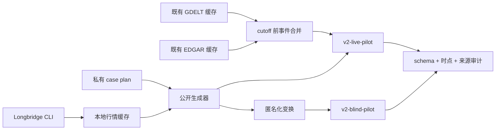

# Bench v2 pilot 数据集设计

日期：2026-07-18  
状态：两组 pilot 已生成、通过审计并发布为不可变 prerelease。

## 1. 决策

Bench v2 pilot 不再要求 blind 与 live 共用同一批原始题目，而是拆成两个用途明确的数据集：

| 数据集           | 运行模式 | 原始数据时间                   | 模型可见身份                           | 目标                                               |
| ---------------- | -------- | ------------------------------ | -------------------------------------- | -------------------------------------------------- |
| `v2-live-pilot`  | `live`   | cutoff、回放和事件均为 2026 年 | 真实代码与真实日期                     | 检验模型面对训练截止后真实市场信息的表现           |
| `v2-blind-pilot` | `blind`  | 允许从 2023—2025 年随机抽样    | 合成代码、合成日期、归一化价格与成交量 | 检验纯量价决策，避免模型依靠股票记忆或已知历史走势 |

两组 pilot 各 12 个 case，均使用 40 个交易日的固定时域 Episode。它们是两个独立样本，不构成一一配对实验。

## 2. 为什么 blind 可以使用更早的数据

Blind 的有效性不取决于原始日期是否晚于模型训练截止，而取决于模型能否识别原始标的和历史事件。只要完整切断这些线索，较早的数据仍可作为未知量价序列使用，并扩大可选市场形态。

Blind 的发布题面必须同时满足：

- 股票代码替换为 `ASSET001.SIM` 这类合成标识；
- cutoff、初始窗口、回放和滚动周期统一平移到合成时间轴；
- 平移保持星期关系，并按目标日期重新计算纽约夏令时；
- cutoff 收盘价归一到 100，全部 OHLC 使用同一比例缩放；
- 日成交量中位数归一到 1,000,000，全部成交量使用同一比例缩放；
- 新闻、财报日历、基本面和资金流全部清空；
- 重新计算日线与周线指标，不复制源数据指标；
- 源代码、源日期和缩放参数只进入 bank 目录以外的私有 provenance，不进入模型输入。

价格和成交量只做线性变换，因此收益率、K 线形态、波动结构、成交量相对关系及回放结果保持不变。

## 3. Live 的 2026 时间边界

`v2-live-pilot` 的“2026 数据”按预测任务边界定义：

| 数据部分                | 时间要求                                   |
| ----------------------- | ------------------------------------------ |
| cutoff                  | 必须在 2026 年                             |
| 40 个交易日回放         | 必须全部在 2026 年                         |
| 模型可见新闻与 SEC 文件 | 必须在 2026 年且不晚于 cutoff              |
| 210 根 1 小时历史       | 允许跨到 2025 年，用于形成 B0 上下文       |
| 250 根日线、104 根周线  | 允许跨到更早年份，用于形成指标所需历史窗口 |

历史上下文早于 2026 不构成答案泄漏。真正需要避开训练记忆的是预测起点、预测目标区间和当时可见事件；若强制所有历史窗口也从 2026 年开始，将无法在年初 case 中提供 250 日和 104 周的统一输入。

## 4. 数据来源



- 1 小时、日线和周线全部来自 Longbridge CLI；抓取结果保存在 `~/.cache/kansoku/bench/sources/episode-market`。
- Live 新闻只使用本机已有的 GDELT 归档匹配缓存和 EDGAR 完整缓存，不在生成时混入当前网页搜索结果。
- 财报日历暂时留空，因为当前接口返回的是现时视角，无法证明它在历史 cutoff 当时已经可知。
- ETF 没有单一公司主体，pilot 中 SPY 的公司新闻为空属于预期行为。

## 5. 生成与审计流程

生成器由私有 plan 驱动：

```bash
pnpm --filter @kansoku/bench cli generate-episode-dataset \
  --plan /path/to/plan.json \
  --dataset-dir /path/to/staging \
  --source-cache-dir ~/.cache/kansoku/bench/sources
```

每个源 case 先按 Longbridge 原始数据执行来源审计，再完成 live 保留或 blind 匿名化，最后对发布题面执行第二次审计。整个数据集仅在全部 case 的来源审计、最终审计和 cohort 策略检查均通过时标记为 `PASS`。

主要检查包括：

- 210 根 1 小时、250 根日线、104 根周线完整且严格递增；
- 40 个回放交易日与 `horizonBars` 一致；
- cutoff 两侧无 K 线重叠；
- 日线和周线滚动回填与 Longbridge 原生周期线一致；
- cutoff 当周只聚合当时已经完成的日线；
- quote 和指标与当前可见 K 线一致；
- Live 的 cutoff、回放和新闻满足 2026 及 point-in-time 约束；
- Blind 的别名、时间平移、归一化和事件清空全部生效；
- Blind bank JSON 不含任何源股票代码。

## 6. 模式约束

新 manifest 增加三个向后兼容字段：

| 字段     | 含义                             |
| -------- | -------------------------------- |
| `status` | `pilot` 或 `production`          |
| `modes`  | 数据集允许的运行模式             |
| `cohort` | `live-2026` 或 `blind-anonymous` |

`sync-dataset` 将这些字段写入 `.kansoku-dataset.json`。私有 runner 在加载题目之前检查安装标记；`v2-live-pilot` 只允许 `--mode live`，`v2-blind-pilot` 只允许 `--mode blind`。发布前 staging 没有安装标记时，runner 改读 `plan.json` 执行相同检查。

旧版 manifest 没有这些字段，继续按原有方式运行。

## 7. 统计边界

`v2-live-pilot` 与 `v2-blind-pilot` 的代码、日期和市场片段不同，因此不能用两组总分相减解释 `noiseDelta`，也不能据此声称新闻带来了因果增益或损失。

- 两组可分别比较模型排序、参与率、净 R、回撤、交易次数和成本；
- `noiseDelta` 只适用于同一 question id 同时运行 blind 与 live 的配对题；
- 若后续需要测量消息面的因果影响，应另建 2026 年配对 ablation cohort，同一行情只切换事件可见性。

## 8. Pilot 已知限制

- 每组只有 12 个 case，只用于验证数据链路和初步观察，不能作为正式排行榜样本量。
- Live 当前只包含 B0 前已经可见的新闻；Episode 推进期间尚未注入逐时到达的新事件。
- GDELT 缓存覆盖的 2026 时间窗有限，pilot cutoff 受现有缓存日期约束。
- 财报日历、历史基本面快照和历史资金流均留空。
- Blind 的 provenance 和质量报告属于评估方私有审计材料；模型运行时只加载 `swing/*.json`，QuickJS 沙箱没有文件系统或网络能力。

正式 v2 数据集发布前，应扩大标的、行业、波动状态和 cutoff 分布，并补齐可按虚拟时钟逐步公开的 point-in-time 事件流。

## 9. 发布结果

| Dataset             | Release                     |          大小 | SHA-256                                                            |
| ------------------- | --------------------------- | ------------: | ------------------------------------------------------------------ |
| `v2-live-pilot@r1`  | `dataset-v2-live-pilot-r1`  | 280,770 bytes | `0bcedc42aa259f3511cce7e71a20497ddd6a39a630212301a52741b4ec539504` |
| `v2-blind-pilot@r1` | `dataset-v2-blind-pilot-r1` | 433,721 bytes | `a3d1d3d4930e3f34acb259097178c369fdee31dd4164cd1b954959a7dc7ac68b` |

两个资产均从 GitHub Release 重新下载并复核字节数、SHA-256、压缩包根目录、bank 题数和质量报告。生成器固定为 `kansoku@36987d43be22df9fd81b341f87292c2e3ad8e4aa`。
